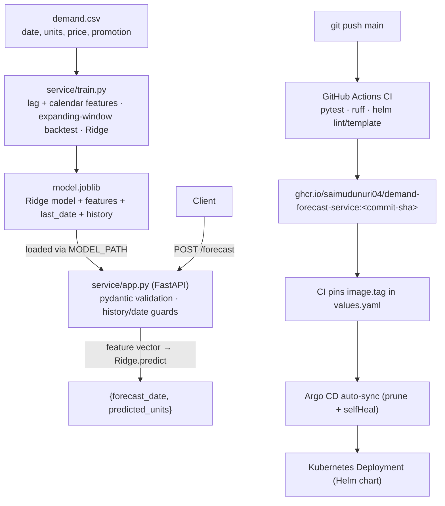

# Demand forecasting

[Architecture](#architecture) · [docs/architecture.md](docs/architecture.md) · [Operations runbook](docs/operations.md) · [Helm chart](k8s/helm/demand-forecast-service/) · [Argo CD application](k8s/argocd/application.yaml)

## Overview

One-step demand forecast service. Trains a Ridge regression model on lag + calendar features with an expanding-window backtest that never uses future actuals, then serves next-day forecasts through a bounded FastAPI API guarded by date and history consistency checks.

> **Reference implementation.** This repo has not been deployed to a live Kubernetes cluster or a real AWS account. The "Measured results" section below contains real engineering measurements taken locally (pytest counts, local uvicorn latency, helm lint/template validation) — not production traffic, not business-data accuracy claims.

## Architecture



Details in [docs/architecture.md](docs/architecture.md) and [docs/operations.md](docs/operations.md).

## Measured results

All numbers measured locally on 2026-09-23 (Python 3.12, repo source, synthetic reference data from the bundled test generator). They are engineering measurements, not production results.

| Measurement | Result |
|---|---|
| pytest | **3 passed** (baseline and after changes — no regressions) |
| ruff check | passes (CI uses `ruff check .`) |
| Training (synthetic reference data: 90 rows, 72 train / 18 holdout, expanding-window backtest) | WAPE **0.0204**, `holdout_days=18` |
| API latency, `POST /forecast` (n=200, all HTTP 200, local uvicorn single worker, freshly trained synthetic artifact) | **p50 3.98 ms, p95 19.81 ms** (min 2.90 ms, max 57.05 ms) |
| `helm lint --strict` | 1 chart linted, 0 failed (informational: icon recommended) |
| `helm template` (default values and CI-mirrored `--set autoscaling.enabled=true --set networkPolicy.enabled=true`) | renders 5 / 7 documents; all parse, required fields present, Deployment `envFrom` ConfigMap reference resolves |

Note: `kubectl apply --dry-run=client` requires a reachable cluster for API discovery; no cluster is available in this environment, so rendered manifests were validated with helm lint/template plus a structural YAML check (apiVersion/kind/metadata + cross-reference resolution) instead of being applied to a live cluster.

## Setup

```sh
python -m pip install -e '.[test]'
python -m pytest -q
ruff check .
helm lint k8s/helm/demand-forecast-service --strict
```

## Usage

Train an artifact, then serve it (the API reads `MODEL_PATH`):

```sh
python -m service.train --train-file /path/to/demand.csv --output artifacts
MODEL_PATH=artifacts/model.joblib uvicorn service.app:app --host 127.0.0.1 --port 8000
```

`/health/live` checks the process; `/health/ready` returns 503 when the model artifact is missing. Responses carry an `X-Request-ID`, `Cache-Control: no-store`, and `X-Content-Type-Options: nosniff`; JSON request logs omit bodies and query strings.

Example against a freshly trained artifact (the history must be the artifact's final seven actual observations, and the forecast date the day after its last training date):

```sh
curl -s http://127.0.0.1:8000/health/ready
curl -s -X POST http://127.0.0.1:8000/forecast \
  -H 'Content-Type: application/json' \
  -d '{"forecast_date":"2025-04-01","last_seven_units":[52,40,42,44,46,48,50],"price":10,"promotion":0}'
# {"forecast_date":"2025-04-01","predicted_units":50.61...}
```

For SageMaker training: `python -m pip install -e '.[aws]'` then `python scripts/launch_sagemaker.py --training-s3-uri s3://your-bucket/demand-training/` (training channel must contain `demand.csv`).

## API reference

| Method & path | Description |
|---|---|
| `GET /health/live` | Process liveness → `{"status": "alive"}` |
| `GET /health/ready` | Readiness; 503 if the model artifact is missing or schema-mismatched |
| `POST /forecast` | One-step forecast. Body: `forecast_date` (ISO date), `last_seven_units` (7 nonnegative floats), `price` (≥0), `promotion` (0/1). Returns `{"forecast_date", "predicted_units"}`. 422 unless the date is the day after training data and the history matches the artifact's final seven observations |

`input demand.csv` requires consecutive daily `date,units,price,promotion` rows (≥35 distinct days). Price and promotion are assumed known at forecast time. The backtest refits on past observations only — no future actual is used in a feature. Never load joblib files from untrusted sources.

## Deployment

**Docker.** `Dockerfile` builds a slim Python 3.11 image running `uvicorn service.app:app` as a non-root user on port 8000.

**Helm.** [`k8s/helm/demand-forecast-service/`](k8s/helm/demand-forecast-service/) is the single source of Kubernetes workload definitions: Deployment, Service, ServiceAccount, ConfigMap, PDB, HPA, NetworkPolicy, plus `NOTES.txt`. Real tunables live in `values.yaml` (validated by `values.schema.json`):

- `image.tag` — pinned by CI to the tested commit SHA (do not edit by hand)
- `config` — non-secret env (e.g. `MODEL_PATH`, default `/models/model.joblib`), rendered into a ConfigMap and injected via `envFrom`
- `envFromSecretName` — credentials from a cluster Secret; never commit secrets
- `volumes` / `volumeMounts` — mount a reviewed model artifact read-only (e.g. at `/models`)
- `resources`, `probes` (startup/readiness/liveness on `/health/*`), `autoscaling`, `pdb`, `networkPolicy`, security contexts, termination timing

```sh
helm lint k8s/helm/demand-forecast-service --strict
helm template demand-forecast-service k8s/helm/demand-forecast-service --namespace demand-forecast-service
helm template demand-forecast-service k8s/helm/demand-forecast-service --namespace demand-forecast-service \
  --set autoscaling.enabled=true --set networkPolicy.enabled=true
```

**Argo CD GitOps flow.** Push to `main` → GitHub Actions CI runs pytest, ruff, and helm lint/template → builds and pushes an immutable image to `ghcr.io/saimudunuri04/demand-forecast-service` with two tags — the commit SHA (immutable, what production runs) and `latest` (convenience) → pins `image.tag` in `values.yaml` to that tested SHA (`[skip ci]`) → Argo CD tracks [`k8s/argocd/application.yaml`](k8s/argocd/application.yaml) and auto-syncs the chart with prune + selfHeal (see the comment header in that file for the placeholders to review per environment). Manifests were validated with `helm lint`/`helm template` and a structural YAML check; not applied to a live cluster.

## Project structure

```
src/service/
  app.py           FastAPI app: /forecast, /health/live, /health/ready, MODEL_PATH artifact loading
  train.py         lag/calendar features, expanding-window backtest, Ridge → model.joblib
  observability.py RequestLoggingMiddleware (X-Request-ID, no-store/nosniff headers, body-free logs)
tests/             backtest + API tests (synthetic data generators)
scripts/launch_sagemaker.py  SageMaker training launcher (aws extra)
k8s/helm/demand-forecast-service/  Helm chart (templates, values, JSON schema)
k8s/argocd/application.yaml        Argo CD Application (auto-sync, documented placeholders)
docs/              architecture.md, operations.md
Dockerfile         non-root uvicorn image
```

## CI status

`.github/workflows/ci.yml` runs on push/PR: install `.[test]` + ruff → `ruff check .` → `pytest -q` → `helm lint --strict` → `helm template` (default and autoscaling+networkPolicy variants). On `main` the `publish` job (needs `test`) logs in to ghcr.io with `GITHUB_TOKEN`, builds/pushes the Docker image with two tags — the commit SHA and `latest` — then pins `image.tag` in `values.yaml` to the tested commit SHA so Argo CD deploys the exact tested image.
